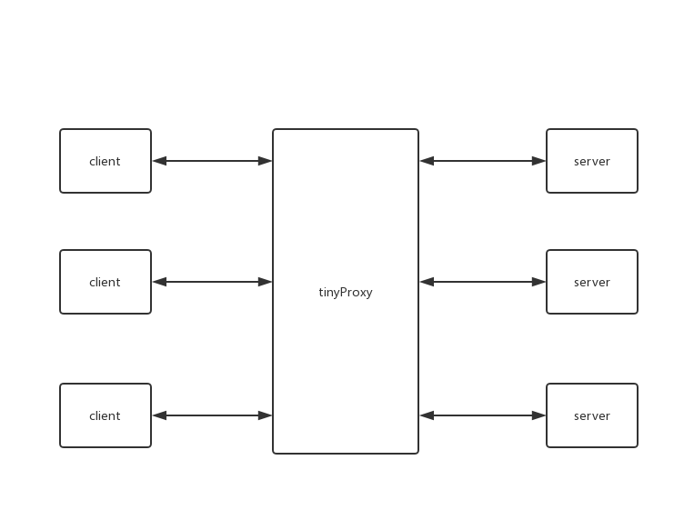

# tinyProxy

轻量的 TCP 代理服务器

## 功能



- 支持基于 TCP 的协议；
- 支持三种不同的调度策略：轮询、随机、基于 IP 的哈希值；
- 支持心跳机制，能及时剔除不能正常工作的 server，同时也能将恢复正常工作的 server 重新加入到可调度的 server 列表中；
- 支持简单的监控，可在网页中国查看连接情况；
- 支持 JSON 配置文件；

## 配置文件

`config_file/default.json`为配置文件，配置文件每一项都是必须的，否则`tinyProxy`无法正常工作。

```json
{
  "service": "ubuntu",
  "host": "127.0.0.1",
  "port": 8889,
  "webport": 8880,
  "strategy": "poll",
  "heartbeat": 60,
  "maxprocessor": 1,
  "backends": [
    {
      "host": "123.207.60.196",
      "port": 11111
    }
  ]
}
```

- `service`：代理服务器的服务名；
- `host`：代理服务器的 host；
- `port`：代理服务器的端口号；
- `webport`：代理服务器监控页面的端口号；
- `strategy`：调度策略；
- `maxprocessor`：线程数；
- `backends`：后端服务器数组；
    - `host`：后端服务器的 host；
    - `port`：后端服务器的端口号。
    
## 使用

```shell script
go run main.go
```